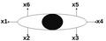
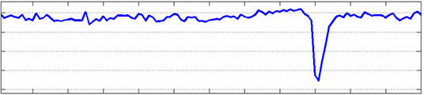
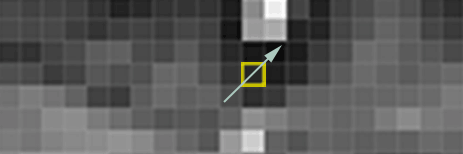
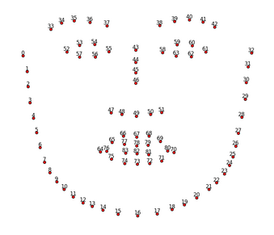
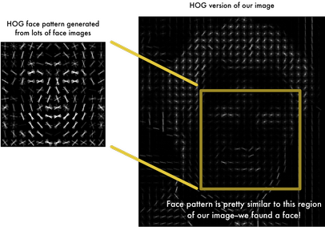

# SelfieVideoVerification

# Detection of Fraudulent listings using fake photos

## Problem 🌍 
With benefits of social media we also face drawback of it on daily basis. We are more prone to fall victim to spam users today than ever before. Spam user can use fake photos of someone else to fool people. This decreases overall confidence of the social media platform. 

## Solution
For this I designed simple online video verification back in 2019 and am sharing it. We can prevent fradulent users by asking people to verify themselves against the photo they have uploaded. 
In verification phase we capture real-time video of user and focus on detecting whether video is genuine and the person in the video matches the person of which photos are uploaded in the account. 

The project in divided into 3 phase:
1. Video Recording
    Capturing video instead of a photo to detect motion
    Capturing on web interface through Stream Recording 
2. Motion Detection
    Asking User to blink in the video.
    Detecting blink to know if its a moving user not a picture.
    Used change of  Aspect ratio of eyes to detect blink
3. Face Matching
    Comparison of frames and uploaded images
    OpenCv and dlib libraries to extract facial landmarks 
    Finding Similarity between images

## Blink Detection
Fetch Frames from video. Detect change in aspect ratio using the following formula. The lowering of aspect ratio and then rising indicates a blink.

Lets say our eye points are as shown in image below:




The our formula turns out to be


We can also see when a person blinks how aspect ratio dips





## Face Matching

Image to intensity binary map (Gradient)
Gradient Deviation to find uniqueness





Face Detection to extract facial landmark




Aligning face and finding similarity between gradient deviation of two images




## Commands to run

To record video:
Open your browser and type in the path of the current project and 'MediaRecorder/index.html'
This will show recording interface where you can record the video and download it

Motion/Blink Detection:

The following command will run the number of blinks in downloaded video when you run it inside BlinkDetector folder and pass the path of video that was downloaded. This will also save the image when person has maximum (open-eyes) and minimum (closed-eyes) aspect ratio. (Blinking)
```
python detect_blinks.py --shape-predictor shape_predictor_68_face_landmarks.dat --video 'path of video'
```

Face Matching:

Run the following command to compare the open-closed eye images computed in last part with the each other and the photo that is on social media platform.
By comparing both open and closed eye image we make sure that a still-image from phone/frame are not shown and blinking image that were captured are compared.

In this command the open and closed are compared between themselves
```
python face_recognition_cli.py --toCompare ../../BlinkDetector/suitableFrame/suitableFrameMin.jpeg --main ../../BlinkDetector/suitableFrame/suitableFrameMax.jpeg
```

And in this command image on social media is compared with open eye image
```
python face_recognition_cli.py --toCompare 'path of image on social media platform' --main ../../BlinkDetector/suitableFrame/suitableFrameMax.jpeg
```

If both the command pass, that mean user has succesfully passed the verification
